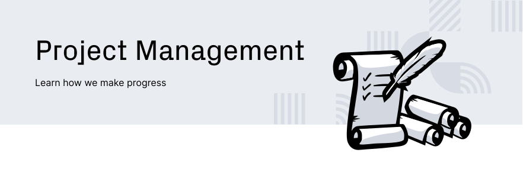
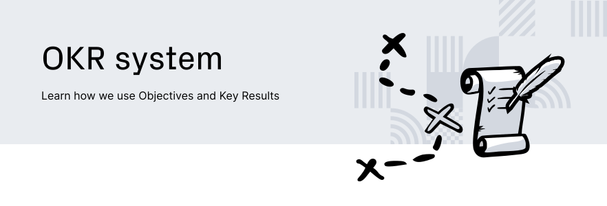
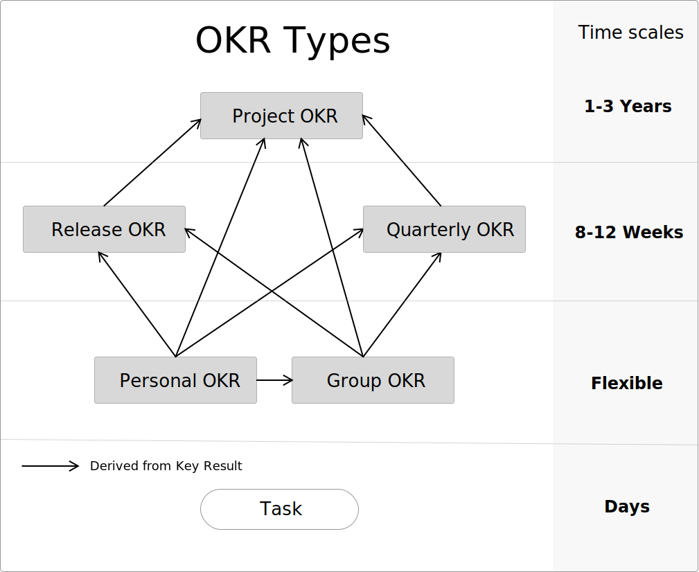
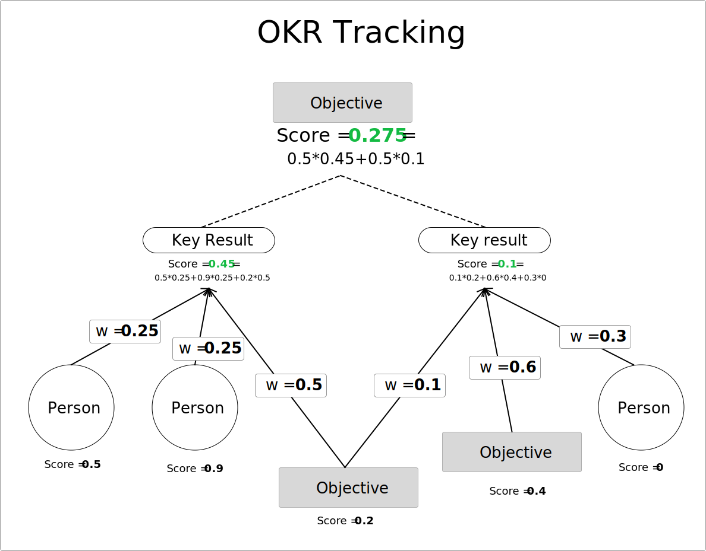

  <h4>Eventually, this all goes on-chain, read our :scroll: <a href="https://github.com/Joystream/whitepaper/blob/master/paper.pdf">whitepaper</a> :scroll:, we are on-chain governance maximalists!<h4>

  <h5>The place to learn about Joystream project planning, collaboration and communication</h5>

  These are our <a href="https://github.com/Joystream/manifesto">ends and means</a>

 

  <h3>
    <a href="/testnets/acropolis">
      Acropolis Testnet
    </a>
     | 
    <a href="/okrs">
      Live OKRs
    </a>
     | 
    <a href="/meetings">
      Meetings
    </a>
     | 
    <a href="https://github.com/Joystream/helpdesk/blob/master/README.md">
      Helpdesk
    </a>
     | 
    <a href="/testnets/rome">
      Rome Testnet
    </a>
  </h3>

Table of Contents
=================

- [Overview](#overview)
- [Contribute](#contribute)
- [Repository Index](#repository-index)
    - [Products and Nodes](#products-and-nodes)
    - [Documentation and Communication](#documentation-and-communication)
    - [Runtime Repos](#runtime-repos)
    - [Libraries and Tools](#libraries-and-tools)
- [Testnet Releases](#testnet-releases)
    - [Live Testnet](#live-testnet)
    - [Next Testnet](#next-testnet)
    - [Past Testnets](#past-testnets)
- [Project Management](#project-management)
    - [Why is this on Github?](#why-is-this-on-github)
    - [Meetings](#meetings)
      - [Daily standup](#daily-standup)
      - [Tuesday all-hands](#tuesday-all-hands)
      - [Release meeting](#release-meeting)
    - [OKR System](#okr-system)
      - [Assignment](#assignment)
      - [OKR types](#okr-types)
      - [Hierarchy](#hierarchy)
      - [Tracking](#tracking)
      - [Template](#template)
    - [Testnet Planning](#testnet-planning)
      - [Branding](#branding)
      - [Testnet Directory](#testnet-directory)
      - [Roles](#roles)
      - [Tracking Issues](#tracking-issues)
      - [Milestones](#milestones)
      - [Step-by-step Process](#step-by-step-process)
- [Github Policy](#github-policy)

# Overview

This landing repo is intended to be the best starting place to get a coherent view of how information is organised in this GitHub organization.

# Contribute

For software development we try to follow the [git-flow](https://nvie.com/posts/a-successful-git-branching-model/) branching [model](https://www.atlassian.com/git/tutorials/comparing-workflows/gitflow-workflow) with some minor differences:
  - `development` branch instead of `develop`.
  - feature branches should be created in contributors' own fork of the repo.
  - for more collaborative long running feature development, a feature branch may be created by the maintainer on the central repo.

The central repos will have multiple members of the core team with write access, but there will be one designated maintainer or "product owner" and responsible for the final product. The maintainer must approve either directly or by delegation (accepting other members' reviews) PRs to be merged.

The core team, maintainers and outside contributors are encouraged to follow these general guidelines when contributing to the code repositories:

* All contributions should be via pull requests.
* Do not create arbitrary branches or push directly to the central repo `master` or `development` branches.
* Do not force push branches.
* Avoid rebasing branches of open PRs to help preserve conversation history.
* Authors must always request a review for their PRs, Exception: It does not alter any logic (e.g. comments, dependencies, docs, file organisation), then it may be merged once CI checks are complete.
* Author should avoid merging their own PR, if it hasn't been reviewed and approved.
* If travis or other CI integrations are configured for the repo, avoid merging PRs that fail checks.
* When the maintainer is opening a PRs they must still request a review from a core team member.

Each repository may have contributing guidelines detailed in their README files.
The maintainer must ensure this contribution section is linked to as the base guideline.

Documentation, project management and other or non-code repositories should try to follow similar PR etiquette if it makes sense but exceptions can be made as changes usually don't require the same level of review.

# Repository Index

This is the set of active repos to which this document refers:

## Products and Nodes

| Repo                                                                                      | Description                                           | Maintainer      |
| :-------------                                                                            | :-------------                                        | :-----------:   |
| [apps](https://github.com/Joystream/apps)                                                 | The Pioneer application.                              | @siman          |
| [substrate-node-joystream](https://github.com/Joystream/substrate-node-joystream)         | The Joystream substrate node.                         | @mnaamani       |
| [storage-node-joystream](https://github.com/Joystream/storage-node-joystream)             | The storage node application.                         | @mnaamani   |
| [query-node-joystream](https://github.com/Joystream/query-node-joystream)                             | Query node for the Joystream Platform.    | @paul           |

## Documentation and Communication

| Repo                                                                                      | Description                                           | Maintainer      |
| :-------------                                                                            | :-------------                                        | :-----------:   |
| [joystream](https://github.com/Joystream/joystream)                             | The Joystream landing repo.    | @bedeho           |
| [joystream-website](https://github.com/Joystream/joystream-website)                       | The Joystream website.    | @bwhm           |
| [whitepaper](https://github.com/Joystream/whitepaper)                                     | The Joystream whitepaper.                             | @bedeho         |
| [communications](https://github.com/Joystream/communications)                             | The Joystream communications workspace and archive.   | @bwhm           |
| [helpdesk](https://github.com/Joystream/helpdesk)                             | Information and guides for users and contributors.    | @bwhm           |
| [bounties](https://github.com/Joystream/bounties)                             | Bounties and testnet payout overview.    | @blrhc           |
| [design](https://github.com/Joystream/design)                             | Joystream brand guide and assets.    | @bwhm           |
| [manifesto](https://github.com/Joystream/manifesto)                             | The Joystream manifesto.    | @bedeho           |

## Runtime Repos

| Repo                                                                                      | Description                                           | Maintainer      |
| :-------------                                                                            | :-------------                                        | :-----------:   |
| [substrate-runtime-joystream](https://github.com/Joystream/substrate-runtime-joystream)   | The Joystream substrate runtime.                      | @mnaamani       |
| [substrate-content-directory-working-group-module](https://github.com/Joystream/substrate-content-directory-working-group-module)                             | A working group module for the Joystream content directory.    | @bedeho           |
| [substrate-versioned-store-permissions-module](https://github.com/Joystream/substrate-versioned-store-permissions-module)                             | Permissioned access to the versioned store.    | @mnaamani           |
| [substrate-versioned-store-module](https://github.com/Joystream/substrate-versioned-store-module)                             | A versioned data store Substrate module.    | @siman           |
| [substrate-recurring-reward-module](https://github.com/Joystream/substrate-recurring-reward-module)                             | Recurring periodic minting of rewards for recipients.    | @mnaamani           |
| [substrate-token-minting-module](https://github.com/Joystream/substrate-token-minting-module)                             | Transferrable capacity constrained token minting.    | @mnaamani           |
| [substrate-hiring-module](https://github.com/Joystream/substrate-hiring-module)                             | Hiring for on-chain organisations.    | @bedeho           |
| [substrate-stake-module](https://github.com/Joystream/substrate-stake-module)                             | Managed staking, unstaking and slashing.    | @mnaamani           |
| [substrate-forum-module](https://github.com/Joystream/substrate-forum-module)                             | The on-chain Joystream community forum.    | @bedeho           |
| [substrate-module-template](https://github.com/Joystream/substrate-module-template)                             | Substrate runtime module template.    | @mnaamani           |

## Libraries and Tools

| Repo                                                                                      | Description                                           | Maintainer      |
| :-------------                                                                            | :-------------                                        | :-----------:   |
| [versioned-store-js](https://github.com/Joystream/versioned-store-js)                             | A typescript library for versioned object store.    | @siman           |
| [query-resolver-toolkit](https://github.com/Joystream/query-resolver-toolkit)                             | A toolkit for query resolution.    | @yourheropaul           |
| [status-endpoint-joystream](https://github.com/Joystream/status-endpoint-joystream)                             | The status endpoint for the Joystream network.    | @bwhm           |

 

Until the Joystream mainnet goes live, a sequence of test networks will be rolled out and deployed, and this section covers this activity.

## Live Testnet

[Acropolis](/testnets/acropolis/README.md)

## Next Testnet

[Rome](testnets/rome)

## Past Testnets

| Network         | Started           | Ended         | Release Plan    |
| -------------   | -------------     | -----         | -----           |
| Athens          | 17.04.19          |   24.06.19    | [Link](/testnets/athens/README.md)        |
| Sparta          | 28.02.19          |   29.03.19    |       N/A        |
| Mesopotamia     | 21.12.18          |   28.02.19    |       N/A        |

 

## Why is this on GitHub?

The reason this is placed in public view on GitHub is two fold:

- **Open Invitation:** Serves as an open invitation for anyone who wants to learn, comment and possibly contribute, to the current or future development of the Joystream project.

- **Best Practices**: Establish best practices which can be replicated by the platform, when it is fully live, in how to collaboratively build and manage the platform using open tools. In particular, the current plan is that the platform has a built-in GitHub equivalent, which thus would allow the use of these conventions.

 

### Itinerary

Meeting itineraries are prepared on a case by case basis, depending on the context, and a template for this, as well as an index of archived itineraries, can be found [here](/meetings).

### Meeting Types

#### Daily standup

- **Description:** Everyone states, within 1 minute, what they accomplished the prior day, and what the goals are for the day. After this, people can start separate calls which need not be conducted in plenum.
- **When:** Every day at 10am (GMT)
- **Where:** Zoom
- **Participant:** Core Jsgenesis team _must_ be present, any one else is welcome (join Telegram for invite).
- **Record&Publish:** YES, if no participant objects.

#### Tuesday all-hands

- **Description:** Everyone states individual:
  1. **OKR Tracking**: Track your OKRs and OKR assignments
  2. **Health Comments:** Any points you wish to discuss related to things like team health, code health, workflow/system health etc.
  3. **Weekly Priorities:** Your top 3-5 priorities this week. *Not* the same as your tasks today.
  4. **Announcements:** Anything you think should be brought to everyone's attention.
- **When:** Every working Tuesday at 10am (GMT)
- **Where:** Zoom
- **Participant:** Core Jsgenesis team _must_ be present, any one else is welcome (join Telegram for invite).
- **Record&Publish:** YES, if no participant objects.

#### Release meeting

- **Description:** Discussion concerning testnet planning and release.
- **When:** On-demand
- **Where:** Zoom
- **Participant:** Core release team _must_ be present, any one else is welcome (join Telegram for invite).
- **Record&Publish:** YES, if no participant objects.

 

Project management is primarily centred around planning and tracking OKRs. OKRs is a planning and project management system, which can be reviewed in further detail [here](https://en.wikipedia.org/wiki/OKR).

### Assignment

A key result can be _assigned_ to a mix of people or other objectives. The _assignment set_ of a key result constitutes the set of relevant actors, directly or indirectly - for OKRs, that are working to satisfy the result. Each assignment is given a weight from 0 to 1, and the total weight across an assignment set is 1. Some key results, in particular for very higher order OKRs, may not have assignments at all times.

### OKR types

The OKRs can be classified into two separate families of types, first:

- **Project OKRs**: Project OKRs can run over multiple years and are graded very rarely. They contain the root objectives that require no deeper justification. Every other objective must be justified directly, or indirectly through another key result, by virtue of its relevance to the project OKRs. The current set of such OKRs can be found [below](#project-okrs).

- **Quarterly OKRs**: Every quarter, new OKRs for the given quarter are derived, referred to as quarterly OKRs. Only OKRs which have independent objectives are formally referred to as quarterly OKRs, any derivative OKR is not, even if derived at the start of a quarter. Importantly, they should contain very little detail about releases. The current set of such OKRs can be found [below](#quarterly-okrs).

- **Release OKRs**: Releases are planned one after the other on a rolling basis, and the release OKRs correspond to a single release. Only OKRs which have independent objectives are formally referred to as release OKRs, any derivative OKR is not, even if derived at in the context of a release. The current set of such OKRs can be found [below](#release-okrs)

and then second:

- **Group OKRs**: Group OKRs are defined by the set of stakeholders assigned to the key results, and in particular that there is more than one person involved. Typically this could be a set of people working as a team on some topic or problem. In principle, such an OKR can be rationalised by a mix of release and quarterly OKRs, but in practice it will most often just be one or the other. These OKRs should be flexible in time scope, and should be reorganized if circumstances change. The current set of such OKRs can be found [below](#group-okrs).

- **Personal OKRs**: The exact same thing as group OKRs, only applying to a single person only. The current set of such OKRs can be found [below](#personal-okrs).

_Note:_ Any OKR from the first family is

 - never a personal OKR, even if assigned to a single person

 - never a group OKR, even if assigned to a multiple persons

The following figure attempts to summarise how these OKR families and types are related, and their relevant temporal scopes.

### Hierarchy

All OKRs, except the project OKR, should be derived, in terms of its objective, from one or more key results of already existing higher order OKRs.

### Tracking

In order to keep track of whether a key result, and thus the corresponding objective, will in the end be satisfied, forecasts are tracked throughout the lifetime of an OKR. Each OKR has its own periodic tracking of progress, and to compute the its forecasted value, do as indicated in the example figure below.

Briefly, do a topological sort of the key result graph, where having an objective in the result assignment set counts towards the indegree. Then just do ascending weighted averaging of scores, where key results are simply averaged into objective scores. Importantly, in order to do this, one has to get personal scores on key results, and there are two modes of doing this:

- **Naive (n)**: Simply evaluate the key result statement directly based on available data at the time. For example, if the result is `Get $100 in revenue`, and one has $20 so far, then the score would be 0.2. This method is often suitable, but no if partial work is unlikely to have had any real world effects while tracking.

- **Estimate of Work Done (ewd)**: Fraction of estimated total hours required that have been completed. This means that, if the estimate of total time required changes, then the score can change, even there is not change in actual hours completed.

The mode used depends on the nature of the key result.

### Template

The template used for recording and tracking OKRs has the following form:

## Objective: `<Name of objective>`
 - **Active from:** `<When the OKR is set/live>`
 - **KR Measurement Deadline**: `<When the final grading is conducted>`
 - **Tracked**: `<Time interval at which OKR is tracked>`
 - **Tracking Manager**: `<Name of person responsible for doing tracking, at given interval, and final grading>`
 - **Key Results**: `<If all key results have same assignment set, write here>`
   1. `<Statement of Key result>` `<n/ewd>`
     - `<Name of assignee>`: `<assignment weight>`
     - ...
   
  - **Final Score:**

  | Date     | KR #1 | ... |  Total |
  |:--------:|:-----:|:-----:|:--------------:|
  | `<final date>` | (`<... assignment set scores>`)  **Total KR score**  | ... |  **Final Objective Score** |

 - **Notes**
    * `<Notes on setup/tracking/final score if necessary>`
    * ...
   

 - **Tracking:**

| Date     | KR #1 | ... |  Comments |
|:--------:|:-----:|:-----:|:--------------:|
| `<date1>` | (`<... assignment set scores>`)  **Total KR score**  | ... |  **Tracking comments** |
| `<date2>` | (`<... assignment set scores>`)  **Total KR score**  | ... |  **Tracking comments** |

 

### Branding

All releases have the following branding materials, which should be summarised in a markdown _Branding Document_:

- **Name:** Our current naming system is important historical ancient cities in the development of new political systems. It's still not clear if we will just stick to ancient cities, or if we will also move forward in time (TBD).
- **Naming Rationale:** A brief 40-150 word text about the significance of this city in our context.
- **Goal:** A brief 100-200 word text about the technical and community goals we are trying to achieve.
- **Logomark:** Illustrated logomark corresponding to name.

### Testnet Directory

All releases should have a corresponding _release directory_ in the `/testnets` directory of this repo, and it should have the following structure:

- `release_name`
  - `README.md`: Release document.
  - `specification.md`: Testnet specification.
  - `/branding`: A directory which includes a branding document and related assets, as described in the branding [section](#branding).

### Roles

#### Release Manager

Each release is directed by a _Release Manager_ (**RM**) who is responsible for:

 - Conduct weekly status meetings (Monday), for each [Tracking Issue](#tracking-issues) of the release.
 - Based on this information, set a weekly tracking score for each KR to be presented and discussed with the team as part of the [Tuesday all-hands](#tuesday-all-hands).
 - Preparing all administrative pull requests for the release on this repo.
 - Follow up the Release [Milestones](#milestones)

### Tracking Issues

A Tracking Issue is a GitHub issue which **evolves**, and at any given time holds a list of TODO items, with a corresponding completion status and possibly responsibility indicator (i.e. each item has one responsible actor). TODO items are grouped into Tracking Issues based on what most deeply facilitates effective collaboration and progress tracking.

- Every Monday, each Tracking Issue will be discussed in a video meeting between all assigned team members and the Release Manager.
- These meetings should be highly focused, and kept at a reasonably high level.
- If a discussion gets to deep, the **RM** can request that the relevant participants schedule a new meeting to address the issue.
- The Release Manager will then update the Tracking Issue if necessary by changing/adding/removing/reassigning tasks, and checking off concluded tasks.
- A concise summary of the meeting shall be added as a comment.

### Milestones

As part of the Release Plan, a set of Milestones are set, with a "target date". Similar to the concept of [Tracking Issues](#tracking-issues), the "Live Milestones" is a GitHub issue which **evolves**. Experience have shown, that during a release cycle:
- we may require adjusting the target date(s)
- we may want to add or remove certain Milestones
- we may want to adjust the scope of certain Milestones

### Standard Release Meetings

In addition to the weekly follow-up meetings addressed above, each release cycle includes the more formal meetings listed below.

- `Launch Meeting`
- `User Stories Meeting`
- `Release Plan Finalization Meeting`
- `Release Checklist Meeting`
- `Lessons Learned`

The **RM** is responsible for scheduling, conducting and taking minutes. Go [here](/meetings) to read about previously held, and scheduled release meetings.

### Step by Step Process

TODO

 

WIP: describe how we use GitHub, in particular

- repo creation, naming and formatting policies
- how to use this repo, in particular managing label sets, projects, etc.
- explain gitflow
- collaboration, membership status policies.
