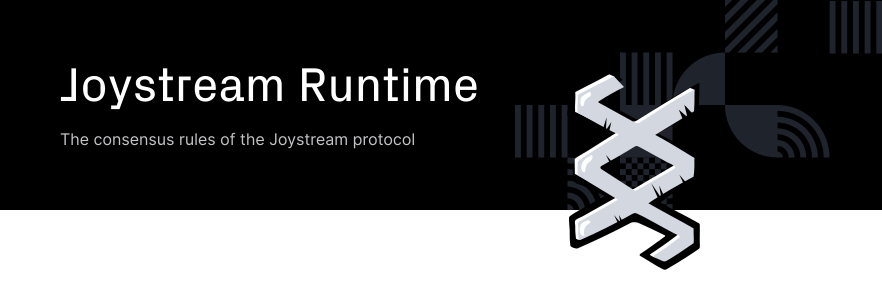

# Joystream

This is the main code reposity for all joystream software. It will  house the substrate chain project, the full node and runtime and all reusable substrate runtime modules that make up the joystream runtime. In addition to all front-end apps and infrastructure servers necessary for operating the network.

The repository is currently just a cargo workspace, but eventually will also contain yarn workspaces, and possibly other project type workspaces.

## Overview

The joystream network builds on a pre-release version of [substrate v2.0](https://substrate.dev/) and adds additional
functionality to support the [various roles](https://www.joystream.org/roles) that can be entered into on the platform.


## Validator


Joystream node is the main server application that connects to the network, synchronizes the blockchain with other nodes and produces blocks if configured as a validator node.

To setup a full node and validator review the [advanced guide from the helpdesk](https://github.com/Joystream/helpdesk/tree/master/roles/validators).


###  Pre-built Binaries

The latest pre-built binaries can be downloads from the [releases](https://github.com/Joystream/substrate-runtime-joystream/releases) page.


### Building from source

Clone the repository and install build tools:

```bash
git clone https://github.com/Joystream/substrate-runtime-joystream.git

cd substrate-runtime-joystream/

./setup.sh
```

### Building

```bash
cargo build --release
```

### Running a public node on the Rome testnet

Run the node and connect to the public testnet.

```bash
cargo run --release -- --chain ./rome-tesnet.json
```

The `rome-testnet.json` chain file can be ontained from the [release page](https://github.com/Joystream/substrate-runtime-joystream/releases/tag/v6.8.0)


### Installing a release build
This will install the executable `joystream-node` to your `~/.cargo/bin` folder, which you would normally have in your `$PATH` environment.

```bash
cargo install joystream-node --path node/
```

Now you can run

```bash
joystream-node --chain rome-testnet.json
```

### Local development

This will build and run a fresh new local development chain purging existing one:

```bash
./scripts/run-dev-chain.sh
```

### Unit tests

```bash
cargo test
```

### API integration tests

```bash
./scripts/run-dev-chain.sh
yarn test
```

To run the integration tests with a different chain, you can omit step running the local development chain and set the node URL using `NODE_URL` environment variable.

## Joystream Runtime




The runtime is the code that defines the consensus rules of the Joystream protocol.
It is compiled to WASM and lives on chain.
Joystream node execute the code's logic to validate transactions and blocks on the blockchain.

When building joystream-node as described abot with `cargo build --release`, in addition to the joystream-node binary being built the WASM blob artifact is produced in:

`target/release/wbuild/joystream-node-runtime/joystream_node_runtime.compact.wasm`


### Deployment

Deploying the compiled runtime on a live system can be done in one of two ways:

1. Joystream runtime upgrade proposals which will be voted on by the council. When the Joystream platform is live, this will be the only way to upgrade the chain's runtime code.

2. During development and testnet phases, we can send an extrinsic (transaction signed with the sudo key) invoking `system::setCode()`. This can be done either from the UI/extrinsics app, or directly with an admin script.

### Versioning the runtime

Versioning of the runtime is set in `runtime/src/lib.rs`
For detailed information about how to set correct version numbers when developing a new runtime, [see this](https://github.com/Joystream/substrate-runtime-joystream/issues/1)


## Coding style

We use `cargo-fmt` to format the source code for consistency.

It should be available on your machine if you ran the `setup.sh` script, otherwise install it with rustup:

```bash
rustup component add rustfmt
```

Applying code formatting on all source files recursing subfolders:

```
cargo-fmt
```

## Contributing

Please see our [contributing guidlines](https://github.com/Joystream/joystream#contribute) for details on our code of conduct, and the process for submitting pull requests to us.

## Authors

See also the list of [CONTRIBUTORS](./CONTRIBUTORS) who participated in this project.

## License

This project is licensed under the GPLv3 License - see the [LICENSE](LICENSE) file for details

## Acknowledgments

Thanks to the whole [Parity Tech](https://www.parity.io/) team for making substrate and helping on riot chat with tips, suggestions, tutorials and answering all our questions during development.
