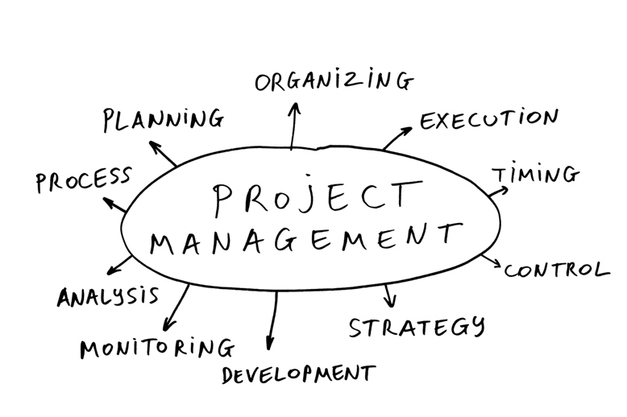

  <h4>Eventually, this all goes on-chain, read our :scroll: <a href="https://github.com/Joystream/whitepaper/blob/master/paper.pdf">whitepaper</a> :scroll:, we are on-chain governance maximalists!<h4>

  <h5>The place to learn about Joystream project planning, collaboration and communication</h5>

  These are our <a href="https://github.com/Joystream/manifesto">ends and means</a>

 

  <h3>
    <a href="/testnets/athens">
      Athens Testnet
    </a>
     | 
    <a href="/okrs">
      Live OKRs
    </a>
     | 
    <a href="/meetings">
      Meetings
    </a>
     | 
    <a href="https://github.com/Joystream/helpdesk/blob/master/README.md">
      Helpdesk
    </a>
  </h3>

# Table of contents

- [Overview](#overview)
- [Contribute](#contribute)
- [Repository Index](#repository-index)
- [Testnet Releases](#testnet-releases)
    - [Live Testnet](#live-testnet)
    - [Next Testnet](#next-testnet)
    - [Past Testnets](#past-testnets)
- [Project Management](#project-management)
    - [Why is this on Github?](#why-is-this-on-github?)
    - [Meetings](#meetings)
      - [Daily standup](#daily-standup)
      - [Monday all-hands](#monday-all-hands)
      - [Release meeting](#release-meeting)
    - [OKR System](#okr-system)
      - [Assignment](#assignment)
      - [OKR types](#okr-types)
      - [Hierarchy](#hierarchy)
      - [Tracking](#tracking)
      - [Schema](#schema)
    - [Testnet Planning](#testnet-planning)
      - [Branding](#branding)
      - [Testnet Directory](#testnet-directory)
      - [Roles](#roles)
        - [Release Manager](#release-manager)
        - [Specification Lead and Committee](#specification-lead-and-committee)
      - [Set-by-step Process](#step-by-step-process)
- [Github Policy](#github-policy)

# Overview

This landing repo as meant as a the best starting place to get a coherent view of how information is organised in this GitHub organization.

# Contribute

WIP.

# Repository Index

This is the set of key repos that

| Repo                                                                                      | Description                                           | Maintainer      |
| :-------------                                                                            | :-------------                                        | :-----------:   |
| [substrate-runtime-joystream](https://github.com/Joystream/substrate-runtime-joystream)   | The Joystream substrate runtime.                      | @mnaamani       |
| [substrate-node-joystream](https://github.com/Joystream/substrate-node-joystream)         | The Joystream substrate node.                         | @mnaamani       |
| [apps](https://github.com/Joystream/apps)                                                 | The Pioneer application.                              | @siman          |
| [storage-node-joystream](https://github.com/Joystream/storage-node-joystream)             | The storage node application.                         | @jfinkhaeuser   |
| [whitepaper](https://github.com/Joystream/whitepaper)                                     | The Joystream whitepaper.                             | @bedeho         |
| [communications](https://github.com/Joystream/communications)                             | The Joystream communications workspace and archive.   | @@bwhm          |

# Testnet Releases

Until the Joystream mainnet goes live, a sequence of test networks will be rolled out and deployed, and this section covers this activity.

## Live Testnet

Sparta

## Next Testnet

[Athens](/testnets/athens/README.md)

## Past Testnets

| Network         | Started           | Ended         | Release Plan    |
| -------------   | -------------     | -----         | -----           |
| Sparta          | x                 |   NA          |       NA        |
| Mesopotamia     | x                 |   x           |       NA        |

# Project Management

## Why is this on Github?

The reason this is placed in public view on Github is two fold

- **Open Invitation:** Serve as an open invitation for anyone who wants to learn, comment and possibly contribute, to the current or future development of the Joystream project.

- **Best Practices**: Establish best practices which can be replicated by the platform, when it is fully live, in how to collaboratively build and manage the platform using open tools. In particular, the current plan is that the platform has a built in Github equivalent, which thus would allow the use of these conventions.

## Meetings

### Itinerary

Meeting itineraries are prepared on a case by case basis, depending on the context, and a template for this, as well as an index of archived itineraries, can be found [here](/meetings).

### Meeting Types

#### Daily standup

- **Description:** Everyone states, within 1 minute, what they accomplished the prior day, and what the goals are for the day. After this, people can start separate calls which need not be conducted in plenum.
- **When:** Every day at 10am (GMT)
- **Where:** Zoom
- **Participant:** Core Jsgenesis team _must_ be present, any one else is welcome (join Rocket.Chat for invite).
- **Record&Publish:** YES, if no participant objects.

#### Monday all-hands

- **Description:** Everyone states individual:
  1. **OKR Tracking**: Track your OKRs and OKR assignments
  2. **Health Comments:** Any points you wish to discuss related to things like team health, code health, workflow/system health etc.
  3. **Weekly Priorities:** Your top 3-5 priorities this week. *Not* the same as your tasks today.
  4. **Announcements:** Anything you think should be brought to everyones attention.
- **When:** Every working monday at 10am (GMT)
- **Where:** Zoom
- **Participant:** Core Jsgenesis team _must_ be present, any one else is welcome (join Rocket.Chat for invite).
- **Record&Publish:** YES, if no participant objects.

#### Release meeting

- **Description:** Discussion about impending testnet release.
- **When:** Weekly
- **Where:** Zoom
- **Participant:** Core release team _must_ be present, any one else is welcome (join Rocket.Chat for invite).
- **Record&Publish:** YES, if no participant objects.

## OKR system

Project management is primarily centred around planning and tracking OKRs. OKRs is a planning and project management system, which can be reviewed in further detail [here](https://en.wikipedia.org/wiki/OKR).

### Assignment

A key result can be _assigned_ to a mix of people or other objectives. The _assignment set_ of a key result consitutes the set of relevant actors, directly or indirectly - for OKRs, that are working to satisfy the result. Each assignment is given a weight from 0 to 1, and the total weight across an assignment set is 1. Some key results, in particular for very higher order OKRs, may not have assignments at all times.

### OKR types

The OKRs can be classified into two separate families of types, first

- **Project OKRs**: Project OKRs can run over multiple years and are graded very rarely. They contain the root objectives that require no deeper justification. Every other objective must be justified directly, or indirectly through another key result, by virtue of its relevance to the project OKRs. The current set of such OKRs can be found [below](#project-okrs).

- **Quarterly OKRs**: Every quarter, new OKRs for the given quarter are derived, referred to as quarterly OKRs. Only OKRs which have independent objectives are formally referred to as quarterly OKRs, any derivative OKR is not, even if derived at the start of a quarter. Importantly, they should contain very little detail about releases. The current set of such OKRs can be found [below](#quarterly-okrs).

- **Release OKRs**: Releases are planned one after the other on a rolling basis, and the release OKRs correspond to a single release. Only OKRs which have independent objectives are formally referred to as release OKRs, any derivative OKR is not, even if derived at in the context of a release. The current set of such OKRs can be found [below](#release-okrs)

and then second

- **Group OKRs**: Group OKRs are defined by the set of stakeholders assigned to the key results, and in particular that there is more than one person involved. Typically this could be a set of people working as a team on some topic or problem. In principle, such an OKR can be rationalised by a mix of release and quarterly OKRs, but in practice it will most often just be one or the other. These OKRs should be flexible in time scope, and should be reorganized if circumstances change. The current set of such OKRs can be found [below](#group-okrs).

- **Personal OKRs**: The exact same thing as group OKRs, only applying to a single person only. The current set of such OKRs can be found [below](#personal-okrs).

_Note:_ Any OKR from the first family is

 - never a personal OKR, even if assigned to a single person

 - never a group OKR, even if assigned to a multiple persons

The following figure attempts to summarise how these OKR families and types are related, and their relevant temporal scopes.

### Hierarchy

All OKRs, except the project OKR, should be derived, in terms of its objective, from one or more key results of already existing higher order OKRs.

### Tracking

In order to keep track of whether a key result, and thus the corresponding objective, will in the end be satisfied, forecasts are tracked throughout the lifetime of an OKR. Each OKR has its own periodic tracking of progress, and to compute the its forecasted value, do as indicated in the example figure below.

Briefly, do a topological sort of the key result graph, where having an objective in the result assignment set counts towards the indegree. Then just do ascending weighted averaging of scores, where key results are simply averaged into objective scores. Importantly, in order to do this, one has to get personal scores on key results, and there are two modes of doing this

- **Naive**: Simply evaluate the key result statement directly based on available data at the time. For example, if the result is `Get $100 in revenue`, and one has $20 so far, then the score would be 0.2. This method is often suitable, but no if partial work is unlikely to have had any real world effects while tracking.

- **Planned Work Done**: Fraction of estimated total hours required that have been completed. This means that, if the estimate of total time required changes, then the score can change, even there is not change in actual hours completed.

The mode used depend on the nature of the key result.

### Schema

The schema used for recording and tracking OKRs has the following form:

 - **Objective:** `<Name of objective>`
 - **KR Measurement Deadline**: `<When the final grading is conducted>`
 - **Tracked**: `<Time interval at which OKR is tracked>`
 - **Tracking Manager**: `<Name of person responsible for doing tracking, at given interval, and final grading>`
 - **Key Results**: `<If all key results have same assignment set, write here>`
   1. `<Statement of Key result>`
     - `<Name of assignee>`: `<assignment weight>`
     - ...
 - **Tracking:**

| Date     | KR #1 | ... |  Total |
|:--------:|:-----:|:-----:|:--------------:|
| `<date&time>` | (`<... assignment set scores>`)  **Total KR score**  | ... |  **Tracked objective score** |

## Testnet Planning

### Branding

All releases have the following branding materials, which should be summarised in a markdown _Branding Document_

- **Name:** Our current naming system is important historical ancient cities in the development of new political systems. It's still not clear if we will just stick to ancient cities, or move forward in time also (TBD).
- **Naming Rationale:** A brief 40-150 word text about the significance of this city in our context.
- **Goal:** A brief 100-200 word text about what technical and community goals we are trying to achieve.
- **Logomark:** Illustrated logomark corresponding to name.

### Testnet Directory

All releases should have a corresponding _release directory_ in the `/testnets` directory of this repo, and it should have the following structure

- `RELEASE_NAME`
  - `README.md`: Release document.
  - **WIP**`specification.md`: Testnet speficiation.
  - `/branding`: A directory which includes a branding document and related assets, as described in the branding [section](branding)
  - `/tutorials`: User facing tutorials for participating on the network.

### Roles

#### Release Manager

Each release is directed by a _Release Manager_ (**RM**) who is responsible for

 - Moving the release process forward and on track.
 - Calling and conducting release meetings.
 - Preparing all administrative pull requests for the release on this repo.

#### Leads

A [release plan](release-plan-template.md) will consist of a set of projects, each with a corresponding lead, these are referred to as the _leads_.

#### Specification Lead and Committee

The specification lead is responsible for moving the specification process forward, and the committee is anyone who is expected to contribute.

**WIP: we need to connect this to broader information about our specification work, but that is not done yet**

### Standard Release Meetings

#### Launch Meeting

First release meeting, should take no more than **45 minutes**, with agenda

1. Propose set of release OKRs based on review of
    - open help desk issues that have bearing on release  
    - any possibly finalised OKRs from prior release
    - project OKRs
2. Identify set of projects, products etc. and assign leads.
3. Assign responsibility to someone for finalising outstanding branding assets, which must be delivered no later than **five days after this meeting**
4. Schedule the [user stories meeting](#user-stories-meeting) to no later than **two working days after this meeting**.

#### User Stories Meeting

Second release meeting, should take no more than **90 minutes**, with agenda

1. For experiences identified in the [launch meeting](launch-meeting), review proposed user stories suggestions prepared by each lead, and settle on final set of stories
2. Schedule the [Release Plan Finalisation Meeting](#release-plan-finalisation-meeting) to no later than **two working days after this meeting**.

#### Release Plan Finalisation Meeting

Third release meeting, should take no more than **90 minutes**, with agenda

1. Finalise release plan based on lead proposals
2. Evaluate whether plan is feasible based on projected total load on contributors, and tentative release date. If not feasible, try to make minor modifications of scope or deadline. If that also does not work, go back and redo process from launch meeting step.

If feasible, then proceed with

3. If a specification is to be done, assign a [specification lead and committee](Specification Lead and Committee), and schedule first [specification planning meeting](#specification-planning-meeting)

#### Specification Planning meeting

Open ended technical meetings which are conducted iteratively with implementing out parts of the release.

### Step-by-step Process

This whole process should take no more than **X** days from start to finish, and involves the following sequence of events and corresponding deadlines.

1. The following must be determined no later than **the day before the prior testnet release.**

    - [**RM**](#release-manager)
    - testnet name, denoted by `TESTNET_NAME`
    - tentative release date

2. **RM** shall have done the following no later than at **the day after the prior testnet release.**

    - created PR establishing a new [testnet directory](testnet-directory), where
        - the release name is set to `TESTNET_NAME`
        - the naming rationale is left blank, unless it is ready
        - the goal is left blank, unless it is ready
        - the logomark is left blank, unless it is ready

    - initiated creation of possibly missing logomark

    - scheduled a meeting time for the [launch meeting](launch-meeting) no later than the next available working day when all core contributors are available.

    - create a subdirectory of the [meeting](meetings) directory that has itinerary with appropriate agenda

3. Conduct launch meeting.

4. After the meeting is over, the **RM** shall on the same day have the testnet directory pull request merged with completed itinerary.

5. Leads must complete their user stories contributions, in the form of PRs into the meeting directory, before the user stories meeting starts.

6. Conduct user stories meeting.

7. After the meeting is over, the **RM** shall have the lead pull requests merged, with possible modifications, no later than **the day after**.

8. Leads must complete their release plan sections, in the form of PRs into the meeting directory, before the release plan finalisation meeting starts.

9. Conduct release plan finalisation meeting.

10. After the meeting is over, the **RM** shall on the same days

    - create a github project per release objective on the [Joystream Github Organisation](https://github.com/orgs/Joystream/projects) which kanban boards with standardized columns: `TODO`, `In progress`, `Done` and `Halted`.

    - update release document link to relevant github projects.

    - updates the label set to reflect any new possible products

10. Specification work begins, and is scheduled and organised on an ad-hoc basis. Anyone unaffected by this work can continue to move forward immediately.

11. Leads must convert their release plan contributions into tangible tasks, in the form of github issues on the relevant github project created. After this process, the release plan itself should no longer be consulted, also if changes are made.

12. Release planning meetings are conducted on a per-need basis, typically more frequently as the release date approaches.

# Github Policy

WIP: describe how we use github, in particular

- repo creation, naming and formatting policies
- how to use this repo, in particular managing label sets, projects, etc.
- explain gitflow
- collaboration, membership status policies.
