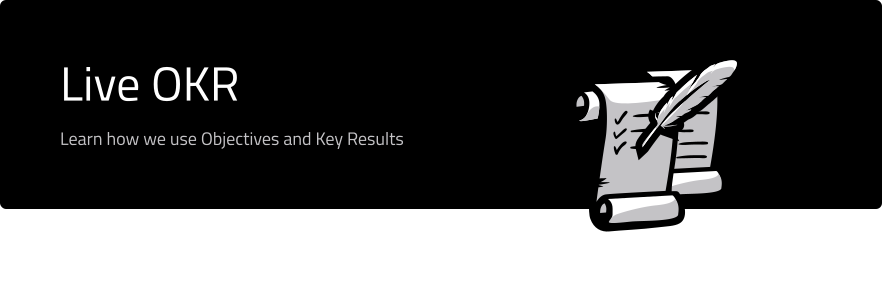

  <h4>These are our currently :microphone: live objectives :microphone: and tracked achievement :crown: </h4>

  <h5>The line between bureaucracy and rigour is 1px thin, but what are we to do? :pray:</h5>

# Table of contents

- [Archive](#archive)
- [Project OKRs](#project-okrs)
  - [Launch Joystream on mainnet](#wip-construction_worker-objective-launch-a-functional-upgradable-video-platform-governed-and-operated-by-a-vibrant-community)
- [Quarterly OKRs](#quarterly-okrs)
  - [Increase the Joystream building power](#objective-increase-the-joystream-building-power)
  - [Expand Joystream brand awareness](#objective-expand-joystream-brand-awareness)
- [Release OKRs](#release-okrs)
  - [Launch Acropolis network](#objective-launch-acropolis-network)
- [Personal OKRs](#personal-okrs)
    - [Bedeho - Improve Technical Productivity of Team](#objective-improve-technical-productivity-of-team)
    - [Martin - Improve value as Release Manager](#objective-improve-value-as-release-manager)

# Archive

Archived OKRs are found in [archive](/OKR-archive), below only live OKRs are found.

# Project OKRs

## !WIP! :construction_worker: Objective: `Launch a functional, upgradable video platform, governed and operated by a vibrant community`
- **Active from:** N/A
- **KR Measurement Deadline:** Joystream autonomous network live
- **Tracked:** Every quarter
- **Tracking Manager:** Martin
- **Key Results:**
  1. `All (IT) infrastructure roles are contested, and at least one professional for profit operation is taking part`
  2. `There are at least 10 builders, with at least 2 in a full time capacity`
  3. `There are at least 100 active governance or operations focused daily active members`
  4. `There are at least 10000 daily active members, as measured by any kind of use of the platform`
  5. `There are at least 200 active publishers, where active is defined as publishing at least once per month`
 

- **Notes**
  * `None`
 

- **Tracking:**

| Date     | KR #1 | KR #2 | KR #3 | KR #4 | KR #5 |  Comments |
|:--------:|:-----:|:-----:|:-----:|:-----:|:-----:|:------:|
| 01.06.19 |   NA  |  NA   |  NA   |  NA   |   NA  | **NA** |

# Quarterly OKRs

## Objective: `Increase the Joystream building power`
- **Active from:** 09.04.19
- **KR Measurement Deadline:** 02.07.19
- **Tracked:** Every other Tuesday
- **Tracking Manager:** Martin
- **Key Results:** Martin, Bedeho and Mokhtar
  1. `Add 1 full time rust developer (ewd)`
  2. `Add 1 full time blockchain developer (ewd)`
  3. `Add 1 full stack developer (ewd)`
  4. `Dev to start work on platform chat (n)`
  5. `Dev to start work on platform forum (n)`
   

- **Notes**
    * `Outside dev (4. and 5.) refers to dev not currently tied to Jsgenesis`
   

- **Tracking:**

| Date     | KR #1 | KR #2 | KR #3 | KR #4 | KR #5 |Comments|
|:--------:|:-----:|:-----:|:-----:|:-----:|:-----:|:------:|
| 23.04.19 |   0   |  0.3  |  0    |  0.05 |   1   | #1-3 from `n` to `ewd` |
| 07.05.19 |  0.1  |  0.5  |  0.1  |  0.5  |   1   | -      |
| 21.05.19 |       |  NA   |  NA   |  NA   |   NA  | **NA** |
| 04.06.19 |   NA  |  NA   |  NA   |  NA   |   NA  | **NA** |
| 18.06.19 |   NA  |  NA   |  NA   |  NA   |   NA  | **NA** |
| 02.07.19 |   NA  |  NA   |  NA   |  NA   |   NA  | **NA** |

## Objective: `Expand Joystream platform awareness`
- **Active from:** 09.04.19
- **KR Measurement Deadline:** 02.07.19
- **Tracked:** Every other Tuesday
- **Tracking Manager:** Martin
- **Key Results:** Martin and Bedeho u.n.o.
  1. `Get 500 sign ups for our Joystream jobs and roles mailing list (n)`
  2. `Get 2000 "Readers" and 5000" "Reads" on our blog in Q2 (n)`
      * `Martin`
  3. `Get 500 downloads per hour spent for "Staked" (n)`
  4. `Complete "Opportunistic joystream.org Website Improvements" (ewd)`
      * `Bedeho` : `0.75`
      * `Martin` : `0.25`
  5. `Get 75% marks on user website comprehension test (ewd)`
      * `Bedeho` : `0.75`
      * `Martin` : `0.25`

   

- **Notes**
    * `Calibration numbers: 0 - 802/1400 - 184 - 0/10 - NA`
    * `KR#4 refers to tasks in https://github.com/orgs/Joystream/projects/3`
   

- **Tracking:**

| Date     | KR #1 | KR #2 | KR #3 | KR #4 | KR #5 |Comments|
|:--------:|:-----:|:-----:|:-----:|:-----:|:-----:|:------:|
| 23.04.19 |(31) **0.06**  |  (182,318) **0.08**   |  (30,5) **0.01** | **0.25** |   0  | Changed #1 from `ewd` to `n`  |
| 07.05.19 |(35) **0.07**   |  (344,552) **0.14**   |  (46,12) **0.01**    |  **0.35**   |   **0.1**  | -|
| 21.05.19 |   NA  |  NA   |  NA   |  NA   |   NA  | **NA** |
| 04.06.19 |   NA  |  NA   |  NA   |  NA   |   NA  | **NA** |
| 18.06.19 |   NA  |  NA   |  NA   |  NA   |   NA  | **NA** |
| 02.07.19 |   NA  |  NA   |  NA   |  NA   |   NA  | **NA** |

# Release OKRs
WIP
## Objective: `Launch Acropolis Network`
- **Active from:** 29.04.19
- **KR Measurement Deadline**: 7-9 days after Acropolis launch (first weekday)
- **Tracked**: Every Monday
- **Tracking Manager**: Martin
- **Key Results**:
1. `Get 200 posts on forum (limits, not Jsg) (ewd)`
    - Bedeho: 3/4
    - Alex: 1/4
2. `All n* modules fully specd (n)`
    - Bedeho: 1/2
    - Mokhtar: n_m/(n*2)
    - Alex: n_a/(n*2)
    - Jens: n_j/(n*2)
    - Bedeho: n_b/(n*2)    
3. `Add tranches to storage-node (ewd)`
    - Jens (2/3)
    - Mokhtar (1/3)
4. `No PRs merged to master (excluding bugfixes and "pioneer") after "Module Test" (ewd)`
    - Martin: 1/2
    - Jens: 1/8
    - Mokhtar: 1/8
    - Bedeho: 1/8
    - Alex: 1/8

`* Bedeho to define n, n_m, n_a, n_j, n_b`

- **Notes**
  * `WIP`
 

- **Tracking:**

| Date     | KR #1 | KR #2 | KR #3 | KR #4 | KR #5 |    Comments       |
|:--------:|:-----:|:-----:|:-----:|:-----:|:-----:|:-----------------:|
| 06.05.19 | -     |    -  |    -  |     - |  -    |       -           |
| 13.05.19 | -     |    -  |    -  |     - |  -    |       -           |
| 20.05.19 | -     |    -  |    -  |     - |  -    |       -           |
| 27.05.19 | -     |    -  |    -  |     - |  -    |       -           |
| 03.06.19 | -     |    -  |    -  |     - |  -    |       -           |
| 10.06.19 | -     |    -  |    -  |     - |  -    |       -           |
| 1x.06.19 | -     |    -  |    -  |     - |  -    |       -           |
| 1x.06.19 | -     |    -  |    -  |     - |  -    | **Actual Score**  |

# Group OKRs

Fill in if needed.

# Personal OKRs

## `Alex` (@siman)

Fill in if needed.

## `Bedeho` (@bedeho)

## Objective: `Improve Technical Productivity of Team`

- **Active from:** 23.04.19
- **KR Measurement Deadline:** 16.07.19
- **Tracked:** Every other Tuesday
- **Tracking Manager:** Martin
- **Key Results:** Bedeho
  1. `Write Rust|Substrate forum module which is ready for release (ewd)`
  2. `Define first full technical specification framework, and apply to a release (ewd)`
  3. `Define runtime architecture guidelines (stretch goal) (n)`

   

- **Notes**
    * `-`
   

- **Tracking:**

| Date     | KR #1 | KR #2 | KR #3 |Comments|
|:--------:|:-----:|:-----:|:-----:|:------:|
| 07.05.19 |  0.3  |  0.5  |  0.15 | Killed KR #4 |
| 21.05.19 |   NA  |  NA   |  NA   | **NA** |
| 04.06.19 |   NA  |  NA   |  NA   | **NA** |
| 18.06.19 |   NA  |  NA   |  NA   | **NA** |
| 02.07.19 |   NA  |  NA   |  NA   | **NA** |
| 16.07.19 |   NA  |  NA   |  NA   | **NA** |

## `Jens` (@jfinkhaeuser)

Fill in if needed.

## `Martin` (@bwhm)

## Objective: `Improve value as Release Manager`
- **Active from:** 23.04.19
- **KR Measurement Deadline:** 16.07.19
- **Tracked:** Every other Tuesday
- **Tracking Manager:** Bedeho
- **Key Results:** Martin
  1. `Improve meeting tracking/reporting system as measured by no more than 1-off 7-day delay of release milestones (ewd)`
  2. `Schedule, perform and report on weekly testing of new features in staging testnet(s) (ewd)`
  3. `Submit minutes for all "Core" release meetings (n)`
  4. `Finish the rust book. (n)`
  5. `Have 2 (/src) PRs merged to our technical repos (n)`

   

- **Notes**
    * `-`
   

- **Tracking:**

| Date     | KR #1 | KR #2 | KR #3 | KR #4 | KR #5 |Comments|
|:--------:|:-----:|:-----:|:-----:|:-----:|:-----:|:------:|
| 07.05.19 |   0.4 |  0.05 |  1.0  |  0.14 |   0   | KR#2 -> ewd |
| 21.05.19 |   NA  |  NA   |  NA   |  NA   |   NA  | **NA** |
| 04.06.19 |   NA  |  NA   |  NA   |  NA   |   NA  | **NA** |
| 18.06.19 |   NA  |  NA   |  NA   |  NA   |   NA  | **NA** |
| 02.07.19 |   NA  |  NA   |  NA   |  NA   |   NA  | **NA** |
| 16.07.19 |   NA  |  NA   |  NA   |  NA   |   NA  | **NA** |

## `Mokhtar` (@mnaamani)

Fill in if needed.
