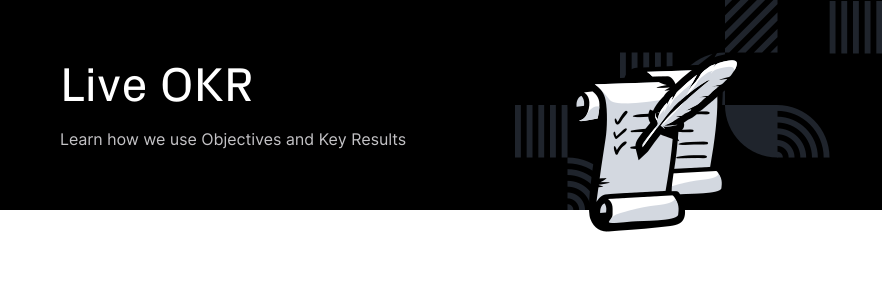

Table of Contents
=================

<!-- TOC START min:1 max:3 link:true asterisk:false update:true -->
- [Archive](#archive)
- [Project OKRs](#project-okrs)
  - [!WIP! :construction_worker: Objective: `Launch a functional, upgradable video platform, governed and operated by a vibrant community`](#wip-construction_worker-objective-launch-a-functional-upgradable-video-platform-governed-and-operated-by-a-vibrant-community)
- [Quarterly OKRs](#quarterly-okrs)
- [Release OKRs](#release-okrs)
  - [Objective: `Introduce a Better Content System`](#objective-introduce-a-better-content-system)
  - [Objective: `Engage community to understand Rome and join us in the future`](#objective-engage-community-to-understand-rome-and-join-us-in-the-future)
- [Group OKRs](#group-okrs)
- [Personal OKRs](#personal-okrs)
<!-- TOC END -->

# Archive

Archived OKRs are found in [archive](OKR-archive), below only live OKRs are found.

# Project OKRs

## !WIP! :construction_worker: Objective: `Launch a functional, upgradable video platform, governed and operated by a vibrant community`
- **Active from:** N/A
- **KR Measurement Deadline:** Joystream autonomous network live
- **Tracked:** Every quarter
- **Tracking Manager:** Martin
- **Key Results:**
  1. `All (IT) infrastructure roles are contested, and at least one professional for profit operation is taking part`
  2. `There are at least 10 builders, with at least 2 in a full time capacity`
  3. `There are at least 100 active governance or operations focused daily active members`
  4. `There are at least 10000 daily active members, as measured by any kind of use of the platform`
  5. `There are at least 200 active publishers, where active is defined as publishing at least once per month`
 

- **Notes**
  * `None`
 

- **Tracking:**

|     Date     |  KR#1  |  KR#2  |  KR#3  |  KR#4  |  KR#5  |        Comments        |
|:------------:|:------:|:------:|:------:|:------:|:------:|:----------------------:|
| dd.mm.yy     |   NA   |   NA   |   NA   |   NA   |   NA   |         **NA**         |

# Quarterly OKRs

TBD

# Release OKRs

## Objective: `Introduce a Better Content System`
- **Active from:** 20.08.19
- **KR Measurement Deadline**: 7 days after Rome launch
- **Tracked**: Every Tuesday
- **Tracking Manager**: Martin
- **Key Results**:
  1. `Members can make a Content Creator profile and publish content under this profile.`

  2. `Introduce the role of staked Content Curators, policed by sudo.`

  3. `Launch with 3 content types.`

  4. `Add 1 new content type after release.`

  5. `Add a new schema for a content type, and migrate only some instances to the new schema.`

 

#### Tracking

|     Date     |  KR#1  |  KR#2  |  KR#3  |  KR#4  |  KR#5  |        Comments        |
|--------------|:------:|:------:|:------:|:------:|:------:|------------------------|
| 27.08.19     |  0.04  |  0.11  |  0.06  |  0.06  |  0.06  |     Weighting v0       |
| 03.09.19     |  0.11  |  0.10  |  0.18  |  0.09  |  0.09  |     Weighting v1       |
| 10.09.19     |  0.11  |  0.21  |  0.22  |  0.09  |  0.09  |     Weighting v2       |
| 17.09.19     |  0.17  |  0.31  |  0.28  |  0.09  |  0.09  |           -            |
| 24.09.19     |  0.22  |  0.41  |  0.50  |  0.19  |  0.19  |           -            |
| 01.10.19     |  0.30  |  0.53  |  0.60  |  0.25  |  0.25  |           -            |
| 08.10.19     |  0.30  |  0.64  |  0.60  |  0.25  |  0.25  |           -            |
| 15.10.19     |  0.30  |  0.67  |  0.68  |  0.38  |  0.25  |           -            |
| 22.10.19     |  0.35  |  0.69  |  0.68  |  0.64  |  0.25  |           -            |
| 29.10.19     |  0.47  |  0.72  |  0.68  |  0.51  |  0.25  |           -            |
| 05.11.19     |  0.47  |  0.73  |  0.68  |  0.51  |  0.25  |           -            |
| 12.11.19     |  0.53  |  0.73  | 0.45`*`|  0.51  |  0.25  |  `*` See note 2.       |
| 19.11.19     |  0.53  |  0.73  |  0.45  |  0.51  |  0.25  |           -            |
| 26.11.19     |  0.53  |  0.76  |  0.45  |  0.51  |  0.25  |           -            |
| 03.12.19     |  0.61  |  0.78  |  0.45  |  0.51  |  0.25  |           -            |
| 10.12.19     |  0.61  |  0.78  |  0.45  |  0.51  |  0.25  |     No updates         |
| 17.12.19     |  0.63  |  0.78  |  0.45  |  0.51  |  0.25  |           -            |
| 24.12.19     |        |        |        |        |        |           -            |
| dd.mm.yy     |        |        |        |        |        |           -            |

#### Tracking Notes

1. Some tweaks to the tracking should be expected. In this case, these changes will be reflected in the comments.
2. It was decided to only launch with two content types, thus the tracked score of KR3 was adjusted by **2/3**.

 

## Objective: `Engage community to understand Rome and join us in the future`
- **Active from:** 20.08.19
- **KR Measurement Deadline**: 7 days after Rome launch
- **Tracked**: Every Tuesday
- **Tracking Manager**: Martin
- **Key Results**:

  1. `20 Content Creator profiles which add at least one content item.`

  2. `Get 5 active Content Curators.`

  3. `At least 20 items for each content type enabled at launch.`

  4. `At least 500 items in total across all content types.`

 

#### Tracking

|     Date     |  KR#1  |  KR#2  |  KR#3  |  KR#4  |        Comments        |
|--------------|:------:|:------:|:------:|:------:|------------------------|
| 27.08.19     |   0    |   0    |   0    |   0    |      Weighting v0      |
| 03.09.19     |   0    |   0    |   0    |   0    |           -            |
| 10.09.19     |   0    |   0    |   0    |   0    |           -            |
| 17.09.19     |   0    |   0    |   0    |   0    |           -            |
| 24.09.19     |   0    |   0    |   0    |   0    |           -            |
| 01.10.19     |   0    |   0    |   0    |   0    |           -            |
| 08.10.19     |   0    |   0    |   0    |   0    |           -            |
| 15.10.19     |   0    |   0    |   0    |   0    |           -            |
| 22.10.19     |   0    |   0    |   0    |   0    |           -            |
| 29.10.19     |   0    |   0    |   0    |   0    |           -            |
| 05.11.19     |   0    |   0    |   0    |   0    |           -            |
| 12.11.19     |   0    |   0    |   0    |   0    |           -            |
| 19.11.19     |   0    |   0    |   0    |   0    |           -            |
| 26.11.19     |   0    |   0    |   0    |   0    |           -            |
| 03.12.19     |   0    |   0    |   0    |   0    |           -            |
| 10.12.19     |   0    |   0    |   0    |   0    |           -            |
| 17.12.19     |   0    |   0    |   0    |   0    |           -            |
| 24.12.19     |        |        |        |        |           -            |
| dd.mm.yy     |        |        |        |        |           -            |

#### Tracking Notes

* `NA`

 

#### OKR Notes

* [Technical OKR](#objective-introduce-a-better-content-system)
  * `1.` A member can create multiple "Content Creator" profiles associated with their membership ID.
  * `3. - 5.` The content types and schemas must be understood by both the runtime and pioneer.

* [Community OKR](#objective-engage-community-to-understand-rome-and-join-us-in-the-future)
  * `2.` "Active" means Content Curators that are not fired as a result of not following their responsibilities.
  * `3. & 4.`: Content "items" means number of entries in the content directory, not the data objects associated with the entry.

See [Release Plan](/testnets/rome/README.md#general) for general notes on the Release OKRs.

 

# Group OKRs

Fill in if applicable.

# Personal OKRs

<!--
## `Alex` (@siman)

Fill in if applicable.

## `Bedeho` (@bedeho)

TBD

## `Martin` (@bwhm)

TBD

## `Mokhtar` (@mnaamani)

-->

Fill in if applicable.
