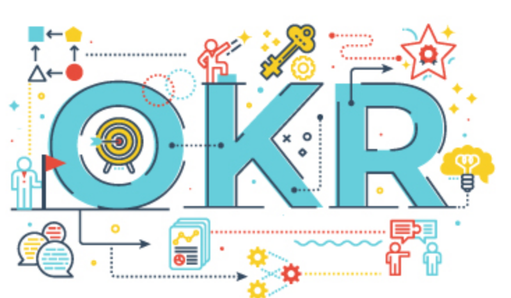

Joystream Project Objectives and Key Results

# Table of contents

- [OKRs](#okrs)
  - [Project OKRs](#project-okrs)
  - [Quarterly OKRs](#quarterly-okrs)
  - [Release OKRs](#release-okrs)
  - [Personal OKRs](#personal-okrs)

# OKRs

Archived OKRs are found in [archive](okr), below only live OKRs are found.

## Project OKRs

### Objective: `Launch a functional, upgradable video platform, governed and operated by a vibrant community`
- **KR Measurement Deadline:** Joystream autonomous network live
- **Tracked:** Every 6 months
- **Tracking Manager:** Martin
- **Key Results:**
  1. `All (IT) infrastructure roles are contested, and at least one professional for profit operation is taking part`
  2. `There are at least 10 builders, with at least 2 in a full time capacity`
  3. `There are at least 100 active governance or operations focused daily active members`
  4. `There are at least 10000 daily active members, as measured by any kind of use of the platform`
  5. `<... something about publishers/content. ..>`
- **Tracking:**

| Date     | KR #1 | KR #2 | KR #3 | KR #4 | KR #5 |  Total |
|:--------:|:-----:|:-----:|:-----:|:-----:|:-----:|:------:|
| 01.06.19 |    NA  |   NA    |  NA     |  NA     |    NA    |     **NA**  |

## Quarterly OKRs

### Objective: `Expand the Jsgenesis team`
- **KR Measurement Deadline:** xxxx
- **Tracked:** Weekly
- **Tracking Manager:** Martin
- **Key Results:** all assigned to Martin and Bedeho equally
  1. `Add full 3 full time blockchain developers`
  3. `Add full 1 time full stack developer`
  4. `Source 25 candidates outside of angel/jsg/dribble/hh`
  5. `Interview at least 25 candidates once, and 15 candidates twice`
- **Tracking:**

| Date     | KR #1 | KR #2 | KR #3 | KR #4 | KR #5 |  Total |
|:--------:|:-----:|:-----:|:-----:|:-----:|:-----:|:------:|
| 18.03.19 |     x  |   x    |  x     |  x     |    x    |     **x**  |

### Objective: `Launch and grow Staked podcast`
- **KR Measurement Deadline:** End of Q1
- **Tracked:** Every 2 weeks
- **Tracking Manager:** Martin
- **Key Results:**
  1. `Launch a new branded podcast available in all major podcast channels`
  2. `Record and publish 5 first episodes`
  3. `Get 100 subscribers`
  4. `Get 500 listens`
- **Tracking:**

| Date     | KR #1 | KR #2 | KR #3 | KR #4 |  Total |
|:--------:|:-----:|:-----:|:-----:|:-----:|:------:|
| 18.03.19      |   1    |   0.4    |   x   |  x      |  **x**     |

## Release OKRs

### Objective: `Launch Athens network`
- **KR Measurement Deadline**: x time after Athens launch
- **Tracked**: Every monday
- **Tracking Manager**: Martin
- **Key Results**:
  1. `Get 10 claims per $ for tokens on our faucet`
    - Mokhtar: 0.5
    - Martin: 0.5
  2. `Have all episodes of the Staked (4) and Make_World (n) podcast in the content directory`
    - Jens: 0.5
    - Martin+Bedeho: 0.5
  3. `Have second council upgrade consensus after reaching quorum`
    - Alex: 0.3
    - Mokhtar: 0.3
    - Martin: 0.3
  4. `20 Uploads (100min) and 100 Downloads not including Jsgenesis`
    - Jens: 0.3
    - Alex: 0.3
    - Mokhtar: 0.3
  5. `75 Memberships created (not including Jsgenesis) at a min 1/2 membership/unique view ratio`
    - Mokhtar: 0.5
    - Alex: 0.5
- **Tracking:**

| Date     | KR #1 | KR #2 | KR #3 | KR #4 | KR #5 |  Total |
|:--------:|:-----:|:-----:|:-----:|:-----:|:-----:|:--------------:|
| 18.03.19 | (1.0 , 0.75)  **0.873**  | (0.66 , 0.9) **0.78**  | (1.0 , 0.8 , 0.8) **0.933**  |  (0.66 , 0, 0) **0.33** |  (0.8 , 0.65) **0.725** |  **0,7282** |

## Group OKRs

Fill in if needed.

## Personal OKRs

### `Alex` (@siman)

Fill in if needed.

### `Mokhtar` (@mnaamani)

Fill in if needed.

### `Martin` (@bwhm)

Fill in if needed.

### `Jens` (@jfinkhaeuser)

Fill in if needed.

### `Bedeho` (@bedeho)

#### Objective: `Make Joystream easier to understand for prospective community members and Jsgenesis hires`
- **KR Measurement Deadline**: xxxx
- **Tracked**: Weekly
- **Key Results**:
  1. `Publish first whitepaper draft`
  2. `Add role list to joystream.org`
- **Tracking:**

| Date     | KR #1 | KR #2 |  Total |
|:--------:|:-----:|:-----:|:------:|
| 18.03.19 |   0.98  | 0.7  | **0.85**   |

#### Objective: `Establish critical routines for future productivity`
- **KR Measurement Deadline**: xxxx
- **Tracked**: Weekly
- **Key Results**:
  1. `Draft planning framework for releases, quarters and longer term`
  2. `Come up with specification framework`
  3. `Learn Rust and Substrate`
  4. `Draft framework for how to plan on Github`
- **Tracking:**

| Date     | KR #1 | KR #2 | KR #3 | KR #4 |  Total |
|:--------:|:-----:|:-----:|:-----:|:-----:|:-----:|
| 18.03.19 |  0.6 |  0.1 | 0.1  | 0  | **0**  |
