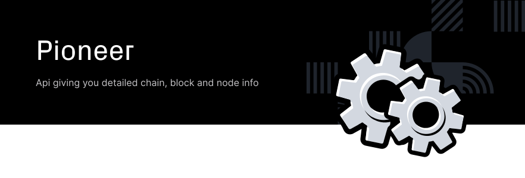

A Portal into the Joystream network. Provides a view and interaction layer from a browser.

This can be accessed as a hosted application via [https://testnet.joystream.org](https://testnet.joystream.org).

## overview

The repo is split into a number of packages, each representing an application. These are -

- [apps](packages/apps/) This is the main entry point. It handles the selection sidebar and routing to the specific application being displayed.
- [apps-electron](packages/apps-electron/) Desktop app running [apps](packages/apps/).
- [page-accounts](packages/page-accounts/) A basic account management app.
- [page-address-book](packages/page-address-book/) A basic address management app.
- [page-explorer](packages/page-explorer/) A simple block explorer. It only shows the most recent blocks, updating as they become available.
- [page-extrinsics](packages/page-extrinsics/) Submission of extrinsics to a node.
- [page-js](packages/page-js/) An online code editor with [@polkadot-js/api](https://github.com/polkadot-js/api/tree/master/packages/api) access to the currently connected node.
- [page-settings](packages/page-settings/) A basic settings management app, allowing choice of language, node to connect to, and theme
- [page-staking](packages/page-staking/) A basic staking management app, allowing staking and nominations.
- [page-storage](packages/page-storage/) A simple node storage query application. Multiple queries can be queued and updates as new values become available.
- [page-toolbox](packages/page-toolbox/) Submission of raw data to RPC endpoints and utility hashing functions.
- [page-transfer](packages/page-transfer/) A basic account management app, allowing transfer of Units/DOTs between accounts.

In addition the following libraries are also included in the repo. These are to be moved to the [@polkadot/ui](https://github.com/polkadot-js/ui/) repository once it reaches a base level of stability and usability. (At this point with the framework being tested on the apps above, it makes development easier having it close)

- [react-components](packages/react-components/) A reactive (using RxJS) application framework with a number of useful shared components.
- [react-signer](packages/react-signer/) Signer implementation for apps.
- [react-query](packages/react-query) Base components that use the RxJS Observable APIs

## development

Contributions are welcome!

To start off, this repo (along with others in the [@polkadot](https://github.com/polkadot-js/) family) uses yarn workspaces to organise the code. As such, after cloning dependencies _should_ be installed via `yarn`, not via npm, the latter will result in broken dependencies.

To get started -

1. Clone the repo locally, via `git clone https://github.com/joystream/apps <optional local path>`
2. Ensure that you have a recent LTS version of Node.js, for development purposes [Node >=10.13.0](https://nodejs.org/en/) is recommended.
3. Ensure that you have a recent version of Yarn, for development purposes [Yarn >=1.10.1](https://yarnpkg.com/docs/install) is required.
4. Install the dependencies by running `yarn`
5. Ready! Now you can launch the UI (assuming you have a local Polkadot Node running), via `yarn run start`
6. Access the UI via [http://localhost:3000](http://localhost:3000)

### Storybook

There is a [StoryBook](https://storybook.js.org) implementation, the UI for which can be started with `yarn storybook` and then accessed in a browser via http://localhost:3001 (and the server will open a new browser tab by default when it starts).

Story code can be placed anywhere in the `packages` directory, and will be detected as long as the file name ends in `.stories.tsx. Stories should be defined in the [Component Story Format (CSF)](https://storybook.js.org/docs/formats/component-story-format) for consistency.

There are several StoryBook addons available, the most useful of which is [Knobs](https://www.npmjs.com/package/@storybook/addon-knobs), which allows props to be altered in real time.

Note that currently StoryBook only allows for stateless components; it has no connection to polkadot.js or any Substrate node. This means that existing components, which are often tightly coupled with the Polkadot API, cannot be used in storybook.
