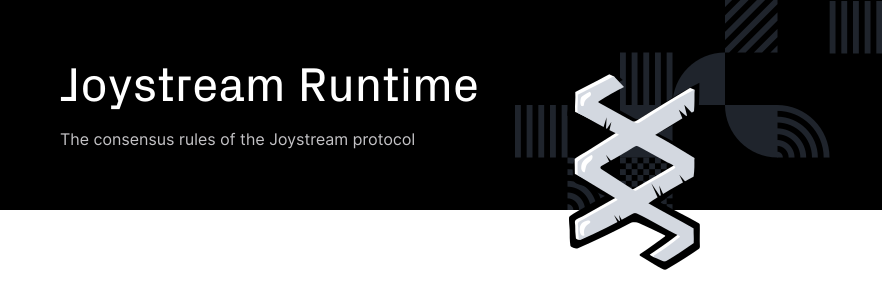

## Joystream Runtime

The runtime is the code that defines the consensus rules of the Joystream protocol.
It is compiled to WASM and lives on chain.
Joystream node execute the code's logic to validate transactions and blocks on the blockchain.

When building joystream-node as described in [../bin/node/README.md](../bin/node/README.md), in addition to the joystream-node binary being built the WASM blob artifact is produced in:

`./target/release/wbuild/joystream-node-runtime/joystream_node_runtime.compact.wasm`

.. relative to the project root directory

### Deployment

Deploying the compiled runtime on a live system is done by creating a proposal for upgrading the Joystream runtime, which will then be voted on by the council. If the proposal is approved, the upgrade will go through after a grace period.

### Versioning the runtime

Versioning of the runtime is set in `runtime/src/lib.rs`
For detailed information about how to set correct version numbers when developing a new runtime, [see this](https://github.com/Joystream/joystream/issues/1)

### Contributing

For more details about how to contribute to the runtime check [RUNTIME-CONTRIBUTING.md](../RUNTIME-CONTRIBUTING.md).