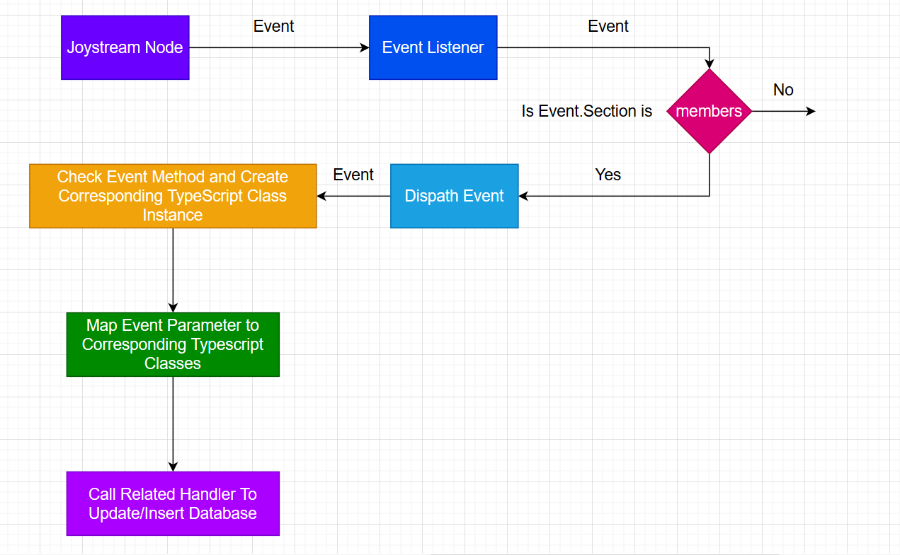

# Substrate Query Node (Experimental)

This is an experimental work, Runtime Event Listener.

### Run Joystream node

In order to run Even Listener a Joystrem node must be running.

```bash
# Purge existing local chain and run local development chain
yes | cargo run --release -p joystream-node -- purge-chain --dev && cargo run --release -p joystream-node -- --dev
```

### Run event listener

1. Install requirements with yarn `yarn install`
2. Setup a PostgreSQL database. Event Listener uses typeorm to connect to database. For database configuration edit `typeorm.json` file. `typeorm.json` contains more than one database connection options and we are going to use option name `test` therefore we need to create a database named `joystream_node_test`:

```bash
$ sudo -i -u postgres
$ createdb joystream_node_test
```

3. To run Event Listener

```bash
yarn start:test
```

### Run buy membership test

Before going to run GraphQL server (joystream-query-node) we will register a member so we can have some data to check.

```bash
yarn test
```

#### How it works


