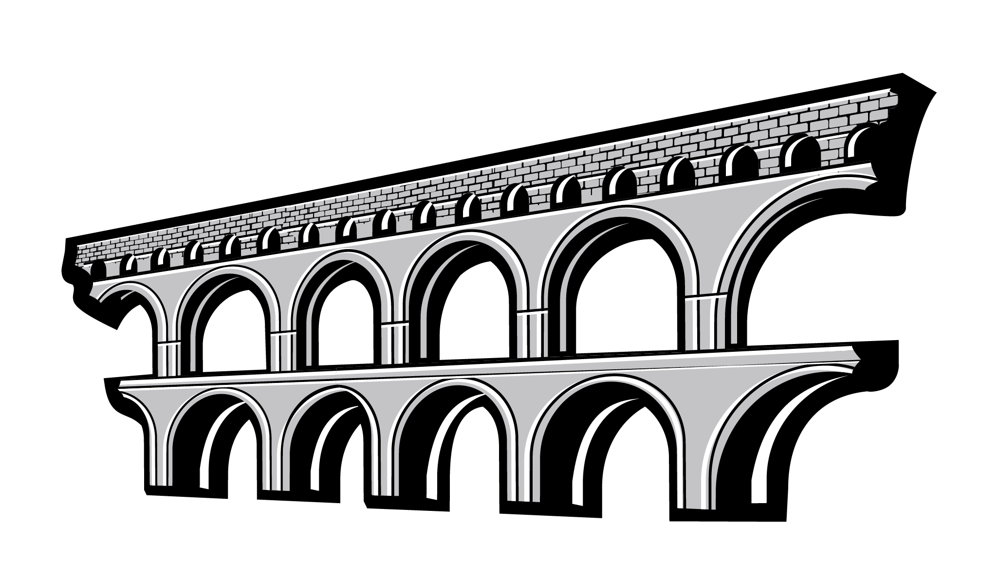

# Table of contents

<!-- TOC START min:1 max:3 link:true asterisk:false update:true -->
- [Table of contents](#table-of-contents)
  - [Name](#name)
  - [Naming Rational](#naming-rational)
  - [Logomark](#logomark)
<!-- TOC END -->

## Name
`Rome`

## Naming Rational
With `Sparta`, `Athens` and `Acropolis`, we have built a basic, but functional governance and media/content distribution system.

Rome was initially intended to be a broad release, with a wide scope and with a longer release cycle. Thus it makes sense to "leave" ancient Greece, and move to another important location in the evolution of democratic principles and the rule of law. After the process outlined in the [Release Plan](/testnets/rome/README.md#overview), the scope was narrowed, but it will still be substantial step for Joystream.

## Logomark

