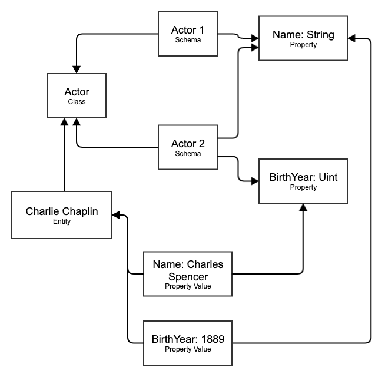

# Versioned Store Module

## Table of Contents

- [Name](#name)
- [Design](#design)
- [Dependencies](#dependencies)
- [Concepts](#concepts)
- [State](#state)
- [Events](#events)
- [Dispatchables](#dispatchables)
- [Non-dispatchables](#non-dispatchables)
  - [create_class](#create_class)
  - [add_class_property](#add_class_property)
  - [add_class_schema](#add_class_schema)
  - [update_entity](#update_entity)
  - [delete_entity](#delete_entity)

## Name

`VersionedStore`

## Motivation

Assume one must model a domain with a large number of entities, where updating representation of an entity must submit to rich dynamic access permissions that live on-chain. Access permissions specifically mean rules about what actor can mutate what representation, and in what way.

Further assume that the representations are structured, in order to allow sufficiently rich and convenient updating, and also linked, to allow semantic depth in the chosen representations. Lastly, they submit to schemas which enforce integrity constraints on the representations.

The problem arises when there is a need to change the schema which currently applies to a large number of entities. This is a computationally expensive operation, which easily could be infeasible within the timeliness constraints of normal blockchain transaction processing.

This can be solved by not requiring all entities to submit to the same schema simultaneously, but instead introducing versioned representations of the same entity through different schemas. This allows the freedom to add newer representations over time, without the need to a large simultaneous migration.

This module embodies such a versioned linked data store.

## Design

The design centers around two key concepts, a _class_ and an _entity_. A class represents a type of entity family, and it may have sequence of _schemas_ associated with it, which defines different ways an entity of the given class may be encoded. A schema can express familiar constraints around what _properties_ an entity must have in order to submit to the schema. A property is defined by some data type requirements, whether it is optional or not, and some metadata. Importantly, one special data type is called the _internal_ property type, which requires an identifier for some entity of a class defined int he store. This is how data is linked. An entity should be understood as some persistent instance of a class that may exist in one or more different versions simultaneously.

### Example

Assume you are modeling two related ideas, the idea of a motion picture and an actor. These two ideas correspond to _classes_.

For an actor, the simplest representation would for example only require one property, their full name. A slightly more advanced representation would be both the name, and a date of birth. These two representations correspond to _schemas_ for the actor class. An actor entity would be a specific actor, like Charlie Chaplin. This entity may live in the data store under only one, or both, schemas mentioned.

For a motion picture, the simplest representation would just be the title name, and a slightly more advanced one could include the lead actor as a property. These two representations are two separate schemas for the motion picture class. A motion picture entity would be a specific motion picture, like The Great Dictator. This entity may live in the data store under only one, or both, schemas mentioned. If being reprsented under the second schema, then the value for the lead actor property would be the identifier of the actor entity Charlie Chaplin.



## Usage

This module has not extrinsics and no concept of permissions or higher level integrity constraints, this must layered on top.

## Dependencies

`None`

## Concepts

```Rust

trait Trait: {
  type ClassId: INTEGER_TRAIT_CONSTRAINTS,
  type EntityId: INTEGER_TRAIT_CONSTRAINTS,
}

struct Class<T: Trait> {
  name: Name,
  description: Description,

  // For Person, think "height", "weight", etc.
  // Unlikely to be more than roughly 20ish, often less.
  properties: Vec<Property>,

  // All scehmas that are available for this class, think v0.0 Person, v.1.0 Person, etc.
  class_schemas: Vec<ClassSchema>
}

struct Entity<T: Trait> {
  class: T::ClassId, // entity is an instance of this class

  // What schemas under which this entity of a class is available, think
  // v.2.0 Person schema for John , v3.0 Person schema for John
  // Unlikely to be more than roughly 20ish, assuming schemas for a given class eventually stableize, or that very old schema are eventually removed.
  schemas: Vec<u32>, // indexes of schema in corresponding class

  // Values for properties on class that are used by some schema used by this entity!
  // Length is no more than Class.properties.
  values: Vec<(u32, PropertyValue)>, // Index is into properties vector of class. Fix anonymous type later.
  name: Name,
  deleted: bool
}

// A schema defines what properties describe an entity
struct ClassSchema<T: Trait> {
  version: Version,
  properties: Vec<uint> // indexes into properties vector for the corresponding class
}

struct Property {
  data_type: PropertyDataType,
  optional: bool,
  name: Name,
  description: Description,
}

enum PropertyDataType {
  External(ExternalProperty),
  Internal(ClassId),
  unsigned_integer_64,
  signed_integer_64,
  float64,
  varchar(u32),
  boolean
}

enum PropertyValue {
  External(ExternalPropertyType),
  Internal(EntityId),
  unsinged_integer_64(u64),
  signed_integer_64(i64),
  float64(f64)
  boolean(bool),
  varchar(Vec<u8>),
  none
}

```

## State

- `ClassById : ClassId => Class`: Classes.
- `EntityById: EntityId => Entity`: Entities.

## Events

**None**

## Dispatchables

**None**

## Non-dispatchables

### create_class

Creates a new class with given name, description, properties and class schemas.

### add_class_property

Adds a property to a given class.

### add_class_schema

Adds a schema to a given class.

### create_entity

Creates an entity, under a given class, which supports a specific given first schema.

### update_entity

Updates all fields in an entity.

### delete_entity

Deletes a given entity.
